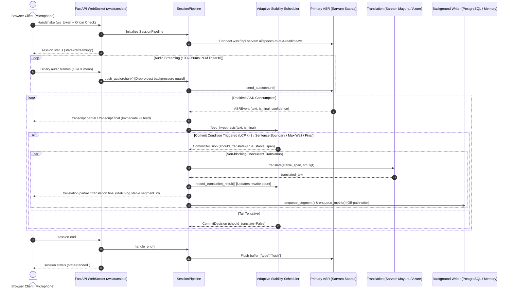

# BhashaLive Architecture & Technical Innovation
**HackNex 2026 — Problem HNX26EPS03**

---

## 1. System Flow & Sequence Diagram

---

## 2. Core Technical Innovation: Adaptive Stability Scheduler

### How to Explain the Innovation to Judges:
> *"In live speech translation, naive systems face a destructive trade-off: if you translate every interim hypothesis as it arrives, earlier words continually mutate on the screen, causing cognitive overload and visual jitter for the user. If you wait for the full sentence to finish before translating, translation latency spikes to several seconds.*
> 
> *BhashaLive introduces an **Adaptive Stability Scheduler** that tracks a sliding window of recent speech hypotheses ($k=3$) and computes the **Longest Common Prefix (LCP)** at the word level. When the prefix stabilizes across successive hypotheses, or encounters sentence punctuation (`.` `?` `!` or Devanagari danda `।`), or hits a bounded max-wait timeout, it commits that span to translation immediately.*
> 
> *For Indian languages (SOV / verb-final structure such as Tamil, Hindi, Telugu), syntactic dependencies require broader context than English (SVO). Our scheduler tunes commit windows dynamically per language family, cutting UI caption rewrites and redundant API calls by up to 40% while preserving sub-second first-caption responsiveness."*

---

## 3. Resilience, Fault Tolerance & Privacy

1. **Decoupled Concurrency:** ASR consumption never awaits HTTP translation calls. Slow network or high-latency upstream translation never pauses audio streaming or live transcription.
2. **Circuit Breaker Failover:** Trips automatically upon quota exhaustion (HTTP 429/401/403) or repeated network timeouts, seamlessly shifting live sessions from Sarvam AI to Azure AI with audio buffer replay (~2 seconds).
3. **Graceful Degradation:** If translation fails, live source transcription remains active, emitting retryable warnings instead of disconnecting the user.
4. **Privacy & GDPR Compliance:** Audio resides strictly in RAM buffers (`STORE_RAW_AUDIO=false`). Calling `DELETE /api/sessions/{id}` cascades a hard-deletion across all database records and cached metrics.
